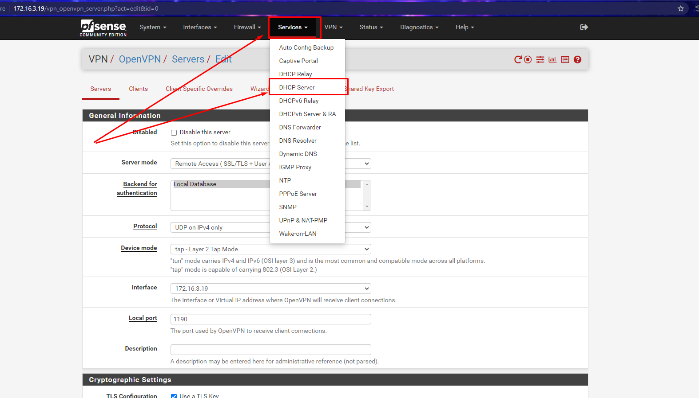
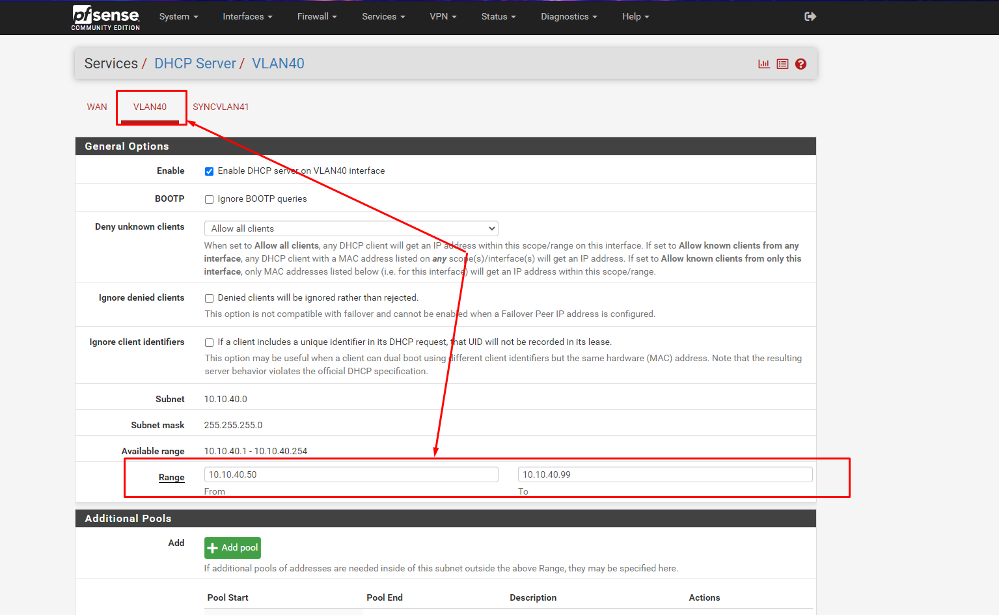
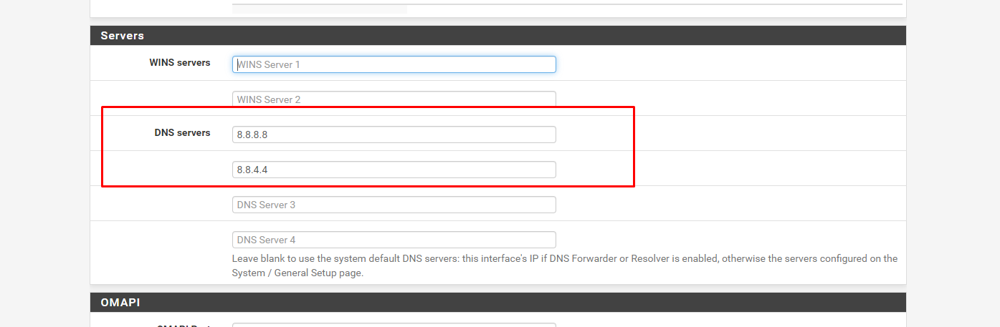
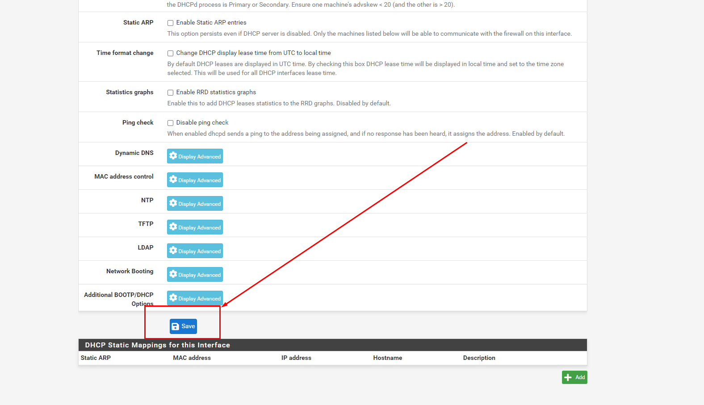
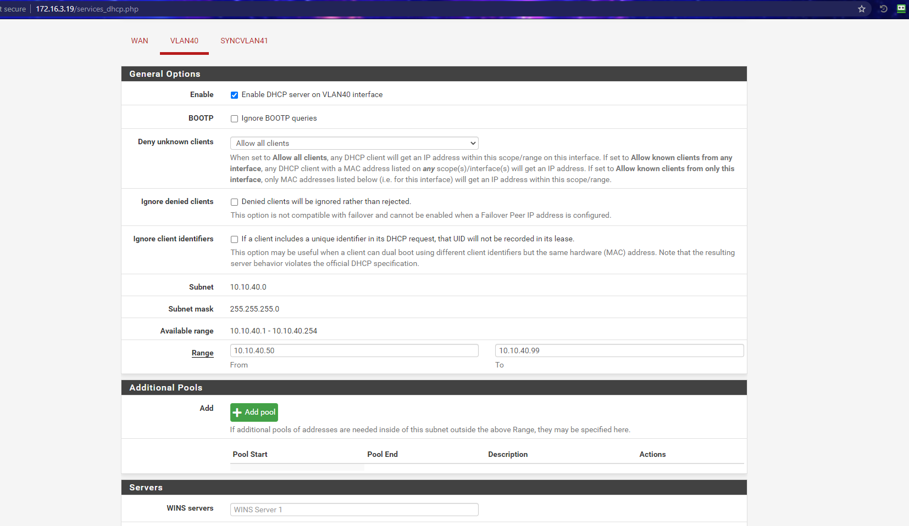
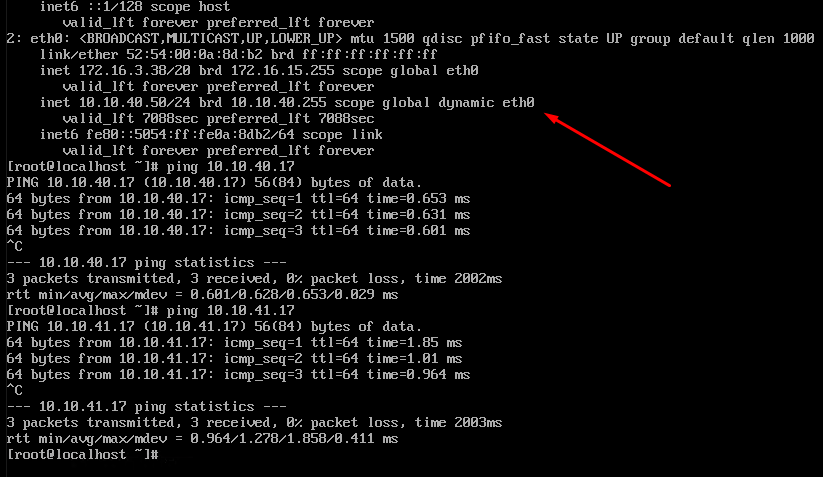

# Cấu hình Pfsense để cấp DHCP cho các VLAN

Cấu hình Pfsense làm Gateway để cấp IP DHCP cho các VM có gắn dải VLAN

## Thực hiện

- Chọn dải VLAN cần cấu hình DHCP, ví dụ ở đây là dải `VLAN40`

Cấu hình range IP có thể cấp DHCP. Ví dụ `10.10.40.50 - 10.10.40.99`

- Cấu hình thêm DNS Server:

- Kết quả:

## Khởi tạo VM để kiểm tra

Cấu hình DHCP cho card mạng của VM, Nhận IP `10.10.40.50`. Kiểm tra ping đến các IP thành công.

