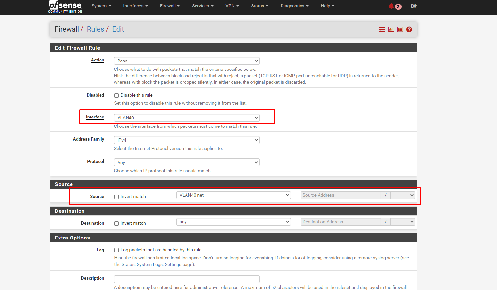

# Cấu hình NAT giữa các VLAN

Ngoài việc sử dụng Push Route để cấu hình giao tiếp giữa Client kết nối đến 1 VLAN và giao tiếp với các Vlan khác. Chúng ta có thể cấu NAT để giao tiếp.

Phương pháp này cũng được sử dụng để cấu hình cho VLAN kết nối đến Internet thông qua Pfsense. Các VM được cấp phát DHCP trên giải VLAN sẽ có thể kết nối được đến với Internet thông qua Pfsense.

Trong bài này ta sẽ cấu hình dải VLAN40 cấp DHCP cho VM có thể kết nối được với Internet. 

## Các bước thực hiện

### Cấu hình rule NAT

Trong phần `Edit Advanced Outbound NAT Entry`

- `Interface`: ta chọn WAN

- `Source`: Dải nguồn để ánh xạ NAT. Chọn dải `10.10.40.0/24` là dải `VLAN40`

- Kết quả:

### Cấu hình Rules cho VLAN40

- Truy cập vào `Firewall` -> `Rules` -> `VLAN40` để add thêm Rules

### Kiểm tra

- SSH đến VM được cấp phát DHCP và ping đến `google.com`

- Kiểm tra traceroute để xem đường đi của gói tin:

Ta có thể thấy đường đi bắt đầu từ Gateway `10.10.40.18` là địa chỉ IP của Pfsense sau đó đi qua Gateway `172.16.10.1` của đường WAN ra ngoài Internet.