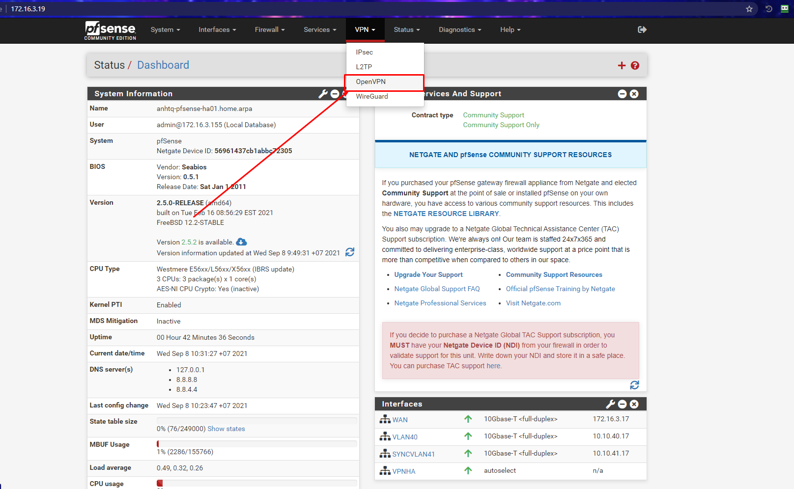
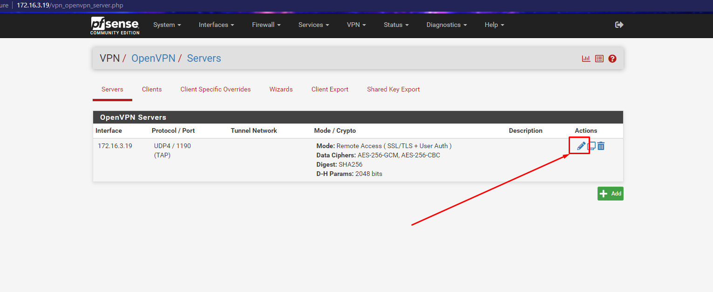
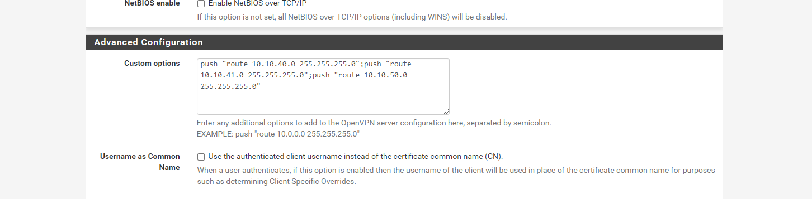
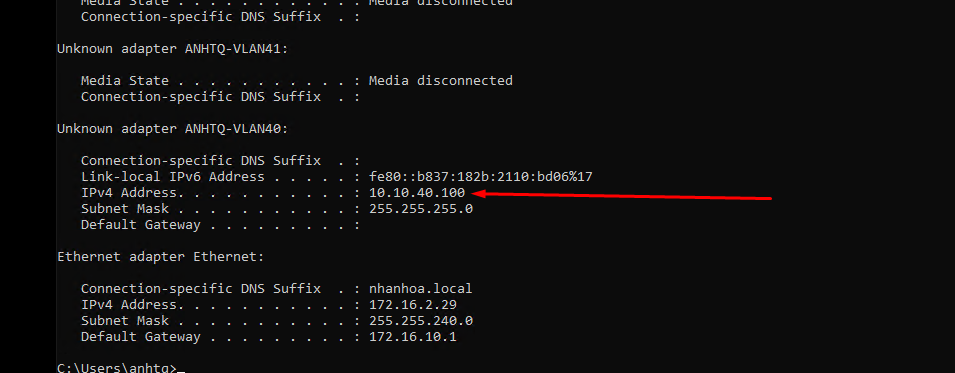
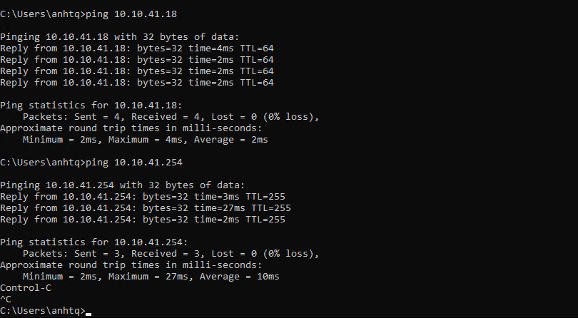

# Cấu hình Push Route để Client có thể ping và truy cập đến các VM Local

## Ví dụ trong bài

Hiện tại Client kết nối đến VPN theo dải VLAN40 - 10.10.40.x/24

Muốn cấu hình VPN có thể kết nối được đến các dải VLAN khác (Ví dụ VLAN41, VLAN50) thì ta thêm cấu hình Push Route.

## Các bước thực hiện





Trong phần `Advanced Configuration` -> `Custom options`, ta thêm cấu hình push route các dải VLAN:

```
push "route 10.10.41.0 255.255.255.0";push "route 10.10.50.0 255.255.255.0"
```

**Lưu ý:** Với mỗi cấu hình `push route` thì cách nhau bởi dấu chấm phẩy `;`

Sau đó tiến hành `Save` lại:



## Tiến hành kết nối VPN từ Client



Kết quả ping thành công:

